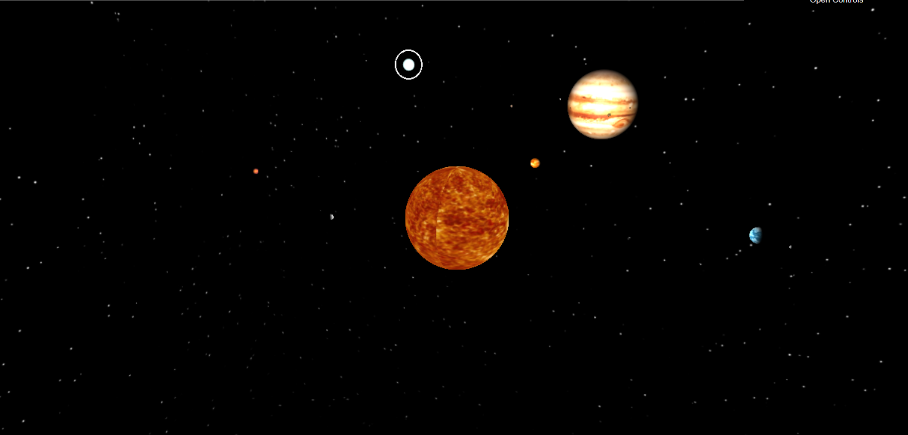

# Three.JS Solar System
An interactive Solar System build with WebGL and the THREE.js graphics framework

# Description
My final project for my Computer Graphics course. We utilized WebGL to implement graphics programming on the web using javascript. This project also utilized the THREE.js framework to easily create Objects, lighting, and effects with an effective API. 

# Installation

